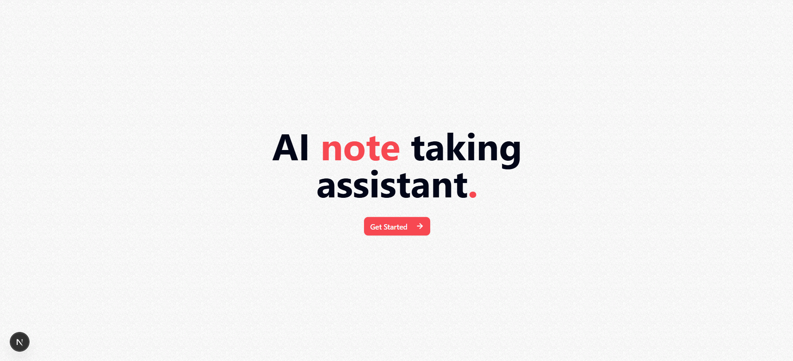
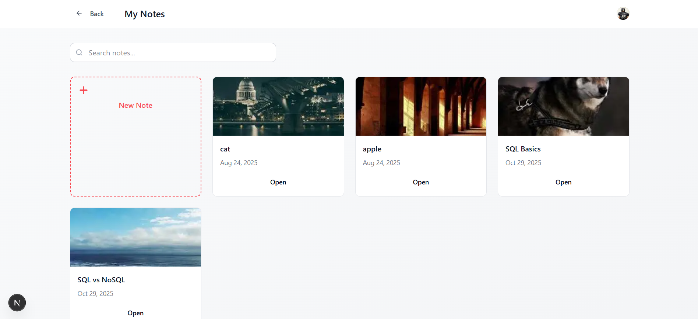
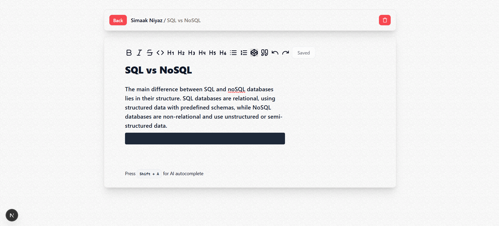

# AI-Powered Note-Taking App

> A modern, intelligent note-taking application with AI autocomplete, rich text editing, and seamless cloud synchronization.



## Features

- **AI-Powered Autocomplete** - Press `Shift + A` for intelligent text completion using Gemini AI
- **Rich Text Editor** - TipTap-based editor with formatting, headings, lists, and more
- **Auto-Save** - Automatic saving with 500ms debouncing
- **Authentication** - Secure user management with Clerk
- **Cloud Sync** - PostgreSQL database with Drizzle ORM
- **Modern UI** - Beautiful interface built with Tailwind CSS and shadcn/ui
- **Responsive Design** - Works seamlessly on desktop and mobile

## Tech Stack

| Category | Technology |
|----------|-----------|
| **Framework** | Next.js 15 (App Router) |
| **Language** | TypeScript |
| **Editor** | TipTap (ProseMirror) |
| **Styling** | Tailwind CSS v4 + shadcn/ui |
| **Database** | PostgreSQL + Drizzle ORM |
| **Auth** | Clerk |
| **AI** | Google Gemini 2.0 |
| **State** | TanStack React Query |
| **Deployment** | Vercel |

## Prerequisites

Before you begin, ensure you have:

- **Node.js** 18 or higher
- **PostgreSQL** database (or use [Neon](https://neon.tech/) for serverless Postgres)
- **Google Gemini API** key ([Get one here](https://ai.google.dev/))
- **Clerk** account for authentication ([Sign up here](https://clerk.com/))

## Installation

1. **Clone the repository**
   ```bash
   git clone <your-repo-url>
   cd simaak-note
   ```

2. **Install dependencies**
   ```bash
   npm install
   ```

3. **Set up environment variables**
   Create a `.env.local` file in the root directory:
   ```env
   # Database
   DATABASE_URL="your-postgresql-connection-string"
   
   # Authentication
   NEXT_PUBLIC_CLERK_PUBLISHABLE_KEY="your-clerk-publishable-key"
   CLERK_SECRET_KEY="your-clerk-secret-key"
   
   # AI
   GEMINI_API_KEY="your-gemini-api-key"
   ```

4. **Set up the database**
   ```bash
   npm run db:generate
   npm run db:push
   ```

5. **Run the development server**
   ```bash
   npm run dev
   ```

6. **Open your browser**
   Navigate to [http://localhost:3000](http://localhost:3000)

## Usage

### Creating Notes



1. Navigate to the dashboard
2. Click "Create Note" 
3. Enter a title - AI will automatically generate a relevant thumbnail
4. Start writing with the rich text editor

### AI Autocomplete


1. **Position your cursor** where you want the AI to continue
2. **Press `Shift + A`** to trigger autocomplete
3. **AI analyzes** the last 30 words for context
4. **Text appears** character by character in real-time
5. **Auto-saves** automatically when complete

### Rich Text Editing
- **Formatting**: Bold, italic, strikethrough, code
- **Headings**: H1, H2, H3 with keyboard shortcuts
- **Lists**: Bullet and numbered lists
- **Code blocks**: Syntax-highlighted code
- **Blockquotes**: Quote formatting

## Development

### Project Structure
```
simaak-note/
├── src/
│   ├── app/                 # Next.js app router
│   │   ├── api/            # API routes
│   │   ├── dashboard/      # Dashboard page
│   │   └── notebook/       # Note editing pages
│   ├── components/         # React components
│   │   ├── ui/            # shadcn/ui components
│   │   └── ...            # Custom components
│   └── lib/               # Utilities and configurations
├── public/                 # Static assets
└── drizzle.config.ts      # Database configuration
```

### Available Scripts
- `npm run dev` - Start development server
- `npm run build` - Build for production
- `npm run start` - Start production server
- `npm run lint` - Run ESLint
- `npm run db:generate` - Generate database migrations
- `npm run db:push` - Push database schema changes

### Key Components
- **`TipTapEditor`** - Main rich text editor with AI integration
- **`CreateNoteDialog`** - Note creation modal
- **`TipTapMenuBar`** - Editor toolbar
- **`Provider`** - React Query provider

## API Endpoints

| Endpoint | Method | Description |
|----------|--------|-------------|
| `/api/createNoteBook` | POST | Create new note with AI-generated thumbnail |
| `/api/saveNote` | POST | Save note content |
| `/api/deleteNote` | POST | Delete a note |
| `/api/completion` | POST | AI text completion using Gemini |

## Security Features

- **Authentication Required** - All routes protected by Clerk middleware
- **User Isolation** - Users can only access their own notes
- **Input Validation** - Sanitized inputs and API rate limiting
- **Environment Variables** - Sensitive keys stored securely

## Deployment

### Vercel (Recommended)
1. Connect your GitHub repository to Vercel
2. Add environment variables in Vercel dashboard
3. Deploy automatically on push to main branch

### Manual Deployment
1. Build the application: `npm run build`
2. Start production server: `npm run start`
3. Set up reverse proxy (nginx/Apache) if needed

## Contributing

1. Fork the repository
2. Create a feature branch: `git checkout -b feature/amazing-feature`
3. Commit your changes: `git commit -m 'Add amazing feature'`
4. Push to the branch: `git push origin feature/amazing-feature`
5. Open a Pull Request

## License

This project is licensed under the MIT License - see the [LICENSE](LICENSE) file for details.

## Support

- **Documentation**: Check this README and inline code comments
- **Issues**: Report bugs via GitHub Issues
- **Discussions**: Use GitHub Discussions for questions and ideas

## Acknowledgments

Built with these amazing technologies:

- [Next.js](https://nextjs.org/) - The React Framework
- [TipTap](https://tiptap.dev/) - Headless Rich Text Editor
- [Clerk](https://clerk.com/) - User Authentication
- [Drizzle ORM](https://orm.drizzle.team/) - TypeScript ORM
- [shadcn/ui](https://ui.shadcn.com/) - Beautiful UI Components
- [Tailwind CSS](https://tailwindcss.com/) - Utility-First CSS
- [Google Gemini](https://ai.google.dev/) - AI Language Model

---

<div align="center">
  <strong>Built using modern web technologies</strong>
  <br />
  <sub>Star this repo if you find it helpful!</sub>
</div>
